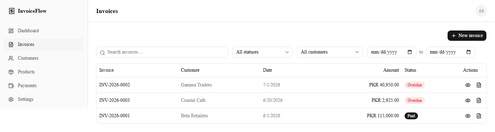

# InvoiceFlow Desktop

<p align="center">
  <b>A self-contained desktop invoicing app for small businesses, freelancers, shops, and service providers.</b>
  <br />
  Create professional invoices and track their payments — no server, no login, no internet required.
</p>

<p align="center">
  
  
  
  
  
  
  
</p>

---

This is the desktop edition of [InvoiceFlow](https://github.com/hamzakhan947075/Invoice-software) — the same Next.js application, packaged as an installable Windows/macOS/Linux app via Electron, with two deliberate simplifications for a single-user desktop tool:

- **SQLite instead of PostgreSQL** — one local file (`invoiceflow.db` in the app's user-data folder), no database server to install or run.
- **No login** — one business per install. The app opens straight to the dashboard; a first-run redirect to Settings replaces the old sign-up flow.

Everything else — invoices, quotes, credit notes, expenses, inventory, recurring invoices, payments, PDF generation — is the same feature set as the web app.

## Screenshots

| Dashboard | Invoice list & filters |
| --- | --- |
|  |  |

| Invoice detail (view, PDF, payments) | Customers |
| --- | --- |
|  |  |

## Features

- **Business profile** — name, logo, contact details, and a default currency across 9 supported currencies (including CNY)
- **Customers** — CRUD, search, and a detail page with invoice history, payment history, and a downloadable PDF statement
- **Products & services** — catalog with pricing, tax rate, and optional inventory tracking
- **Invoices** — a dynamic line-item builder with live totals, server-authoritative recalculation, a status lifecycle (Draft → Sent → Partially Paid/Paid, or Cancelled/Overdue), and a status dropdown for quick changes (Mark as Sent/Paid/Overdue, Cancel)
- **Quotes/estimates** — the same line-item builder as invoices, with one-click conversion of an accepted quote into a real, editable draft invoice
- **PDF generation** — professional invoice, quote, and per-customer statement PDFs, generated locally, no cloud rendering service
- **Payments** — record payments with overpayment protection and a full payments ledger
- **Credit notes** — issue one against a sent/partially-paid invoice to reduce its balance due, with an audit trail
- **Expense tracking** — categorized expense records with search/category filtering and a dashboard total
- **Inventory** — optional per-product stock tracking with a reorder-level threshold and an auditable stock-movement log — stock only changes through an explicit adjustment, never automatically from invoicing
- **Recurring invoices** — a schedule (weekly/monthly/quarterly/yearly) that auto-generates a real invoice each cycle, checked once on every app launch
- **Dashboard** — total invoiced/paid/outstanding/overdue/expenses, recent invoices, and a monthly revenue chart

## Tech Stack

| Layer | Choice |
| --- | --- |
| Shell | Electron — spawns the built Next.js server as a local child process and loads it in a `BrowserWindow` |
| Framework | Next.js (App Router) + TypeScript + React |
| Styling | Tailwind CSS + shadcn/ui + Lucide Icons |
| Database | SQLite via Prisma ORM (`@prisma/adapter-libsql` driver adapter) — one file per install |
| Validation | Zod |
| Forms | Server Actions (`FormData` + `useActionState`) for simple forms; React Hook Form + `useFieldArray` for line-item builders |
| PDF generation | `@react-pdf/renderer`, rendered server-side in Route Handlers |
| Packaging | electron-builder (NSIS on Windows, dmg on macOS, AppImage/deb on Linux) |
| Testing | Vitest |

## Getting Started (development)

### Prerequisites

- Node.js 20+

No database server, no `.env` secrets beyond an optional cron token — SQLite is a plain file.

### 1. Install dependencies

```bash
npm install
```

### 2. Configure environment variables

```bash
cp .env.example .env
```

| Variable | Description |
| --- | --- |
| `DATABASE_URL` | SQLite file path, e.g. `file:./dev.db` (default) |
| `CRON_SECRET` | Authorizes calls to `/api/cron/recurring-invoices`, checked once automatically on every app launch |

### 3. Set up the database

```bash
npx prisma generate
npx prisma migrate dev
npx tsx prisma/seed.ts
```

This creates the schema and seeds one demo business with customers, products, and invoices in different states (paid, partially paid, overdue).

### 4. Run in the browser (fastest iteration loop)

```bash
npm run dev
```

Open [http://localhost:3000](http://localhost:3000). This is the plain Next.js dev server — useful for iterating on UI without relaunching Electron every time.

### 5. Run inside the Electron shell

```bash
npm run electron:dev
```

Runs `next dev` on a fixed port and opens it inside an Electron window — the same shell the packaged app uses, without a production build.

### 6. Build the installer

```bash
npm run electron:pack:win     # Windows .exe (NSIS)
npm run electron:pack:mac     # macOS .dmg — needs to run on macOS (or CI)
npm run electron:pack:linux   # Linux AppImage + .deb
```

This runs `next build` with `output: "standalone"`, bundles it as an Electron resource, and produces an installer under `release/`. On first launch, the packaged app creates its SQLite database and uploads folder under the OS's per-user app-data directory, and applies any pending migrations automatically.

### Running tests

```bash
npm test
```

## Project Structure

```text
electron/
  main.ts               # App lifecycle: spawns the Next server, opens the window, first-launch migrations
  migrate.ts             # Lightweight SQL migration runner (applies prisma/migrations/*.sql directly —
                          #   avoids bundling the full Prisma CLI, which is a devDependency only)
scripts/
  copy-standalone-assets.mjs  # Copies public/ and .next/static/ into .next/standalone/ post-build
src/
  app/
    (app)/                # Every page, each with its own page.tsx + actions.ts (no auth route group anymore)
      page.tsx              #   dashboard
      customers/, products/, invoices/, quotes/, expenses/, credit-notes/, payments/, settings/
    api/
      uploads/[...path]/     # Serves runtime-uploaded files (logos) from a per-user directory, not `public/`
      cron/recurring-invoices/  # Checked once per app launch by electron/main.ts
  components/            # Feature-specific forms/dialogs/views, plus shared/, layout/, ui/ (shadcn primitives)
  lib/
    auth/current-user.ts  # requireCurrentBusiness() — the single seam every feature reads businessId from;
                           #   auto-creates the one local Business row on first run, no session involved
    uploads.ts             # Resolves the uploads root — public/uploads in dev, a per-user dir when packaged
    validations/           # Zod schemas — one file per domain
    pdf/                   # @react-pdf/renderer document definitions
    invoice-calculations.ts # The one place line-item/invoice/payment money math happens
    invoice-status.ts       # "Overdue" derivation (automatic + manual) + status-filter query builder
    recurring-invoice-generator.ts   # Turns one due template into a real Invoice
    *.test.ts                # Vitest unit tests, colocated with the code they test
prisma/
  schema.prisma            # Database schema (SQLite)
  migrations/              # Plain SQL migrations, applied by both `prisma migrate` (dev) and electron/migrate.ts (packaged)
  seed.ts                  # Dev/test seed data
```

## Architecture & Engineering Notes

<details>
<summary><b>Why Electron spawns a real local server (click to expand)</b></summary>

- The app has real Server Actions and Route Handlers (PDF generation, the recurring-invoice check) — it can't be a static export. `next.config.ts` sets `output: "standalone"`, which produces a self-contained server bundle (`.next/standalone/server.js`) that `electron/main.ts` spawns as a plain Node child process bound to `127.0.0.1` on a fixed local port, then points a `BrowserWindow` at it. This is the same shape as running the app in a browser tab — just with Electron providing the window and lifecycle instead of a real browser.
- `output: "standalone"` does not copy `public/` or `.next/static/` on its own — `scripts/copy-standalone-assets.mjs` does that as an explicit build step; skipping it builds fine but 404s on every static asset once packaged.
- In dev mode, `electron/main.ts` skips spawning anything and just points the window at the already-running `next dev` server (`npm run electron:dev` runs both together on a fixed port) — much faster iteration than rebuilding standalone output on every change.

</details>

<details>
<summary><b>SQLite, migrations, and money math (click to expand)</b></summary>

- **Prisma 7** on SQLite supports both `Decimal` and native enums directly — no schema-level workarounds were needed migrating off Postgres, only the Postgres-only `@db.Decimal(x,y)`/`@db.Date` native-type annotations and the Postgres-only `mode: "insensitive"` search filter had to go (SQLite's default `LIKE` is already ASCII case-insensitive, which covers this app's data).
- All monetary fields stay `Prisma.Decimal` — never floating point — exactly as in the web app; `src/lib/invoice-calculations.ts` is still the one place that math happens.
- **Migrations run two different ways depending on context**: local development uses the normal `prisma migrate dev` CLI. The packaged app uses `electron/migrate.ts`, a small custom runner that reads the same `prisma/migrations/*/migration.sql` files and applies any not yet recorded in a `_app_migrations` tracking table — this avoids bundling the full `prisma` CLI (a devDependency, correctly excluded from the production package by electron-builder) just to run `migrate deploy` at runtime. Both paths apply the exact same SQL.
- The driver is `@prisma/adapter-libsql` (not `better-sqlite3`) specifically because it ships prebuilt native bindings per platform via npm — `better-sqlite3` needs a C++ toolchain to compile from source unless a matching prebuilt binary exists, which added a real, unnecessary build dependency for a desktop packaging story that already has enough moving parts.

</details>

<details>
<summary><b>Single-business, no login (click to expand)</b></summary>

- `requireCurrentBusiness()` (`src/lib/auth/current-user.ts`) is still the one function every Server Action/page calls to get `business.id` for tenant-scoped queries — it's just been reimplemented to return the single local `Business` row (auto-creating a placeholder one on first run) instead of resolving it from a session. Every one of the ~30 files that call it needed zero changes.
- The `(app)` layout no longer gates on a session; instead, a small client component redirects to Settings once if the business is still the auto-created placeholder — reusing the existing business-profile form as first-run setup rather than building a separate onboarding wizard.
- Uploaded logos move from `public/uploads/` to a path resolved via `UPLOADS_DIR` (`src/lib/uploads.ts`), served through a new `/api/uploads/[...path]` route with a path-traversal guard — `public/` lives inside a read-only install location once packaged, so runtime-written files can't go there.

</details>

<details>
<summary><b>Invoicing, PDF, payments, quotes, credit notes, expenses & inventory (click to expand)</b></summary>

- **Money math lives in one place**: `src/lib/invoice-calculations.ts`. The invoice form previews totals client-side for responsiveness, but every Server Action recomputes totals from the submitted line items before writing anything.
- **Invoice status**: `DRAFT → SENT → PARTIALLY_PAID/PAID`, `CANCELLED`, and `OVERDUE` can all be stored now — `OVERDUE` is either derived automatically (`dueDate < today AND balanceDue > 0`) or set manually via "Mark Overdue," and both are treated identically everywhere permissions are checked.
- **Overpayment is blocked**, and payment/credit-note writes are transactional with an optimistic-concurrency guard — the balance is re-read inside the same transaction that writes it.
- **Quotes** mirror invoices' line-item builder and money math exactly; converting one creates a real, independent `DRAFT` invoice and stamps `convertedInvoiceId` so it can't be converted twice.
- **Credit notes** reduce `balanceDue` directly, never `total` (which stays the historical billed amount), flipping the invoice to `PAID` if the credit fully offsets the balance.
- **Inventory is manual by design** — `Product.stockQuantity` only changes through an explicit "Adjust Stock" action, which always creates a `StockMovement` audit row in the same transaction. Invoicing never touches it.
- **Recurring invoices**: `electron/main.ts` calls the existing `/api/cron/recurring-invoices` route (with `CRON_SECRET`) once after the server responds on every app launch — the same route the web app's Vercel Cron used, just triggered differently.

</details>

## Roadmap

The desktop packaging is new — remaining work before a wider release: code-signing (unsigned builds trigger Windows SmartScreen / macOS Gatekeeper warnings), a real app icon, and CI-built macOS/Linux installers (only Windows can be built locally on a Windows dev machine).

## Known Limitations

- **Verify GUI launch on a real desktop.** The packaged installer builds successfully and every underlying piece (the standalone server, the SQLite migration runner, database seeding) has been verified directly, but launching the actual `.exe` window was not verifiable in the sandboxed environment this was built in (no interactive desktop session for Electron/Chromium to attach a window to). Run the installer on a normal Windows machine and confirm the window opens before distributing it further.
- **No code signing.** Unsigned Windows/macOS builds will show a security warning on first launch — expected for personal/local use, not a functional bug.
- **macOS and Linux builds** need to run on their respective OS (or CI) — electron-builder's config supports all three targets, but only Windows can be produced from this Windows dev machine.
- `npm audit` may report advisories in transitive build-tooling dependencies (electron-builder's own dependency tree) — these affect the packaging toolchain, not the shipped app's runtime code.

## License

MIT
